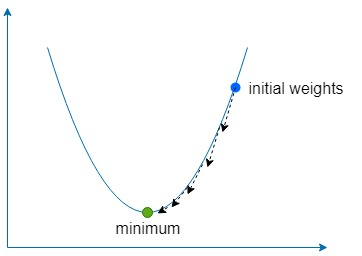

# Simplest artificial neural network

This is the simplest artificial neural network possible explained and demonstrated. 

## This is part 1 of a series of github repos on neural networks

- part 1 - simplest network (**you are here**)
- [part 2 - backpropagation](https://github.com/gokadin/ai-backpropagation)
- [part 3 - backpropagation-continued](https://github.com/gokadin/ai-backpropagation-continued)

## Table of Contents

- [Theory](#theory)  
  - [Mimicking neurons](#mimicking-neurons)
  - [A simple example](#a-simple-example)
  - [The error](#the-error)
  - [Gradient descent](#gradient-descent)
- [Code example](#code-example)
- [References](#references)

## Theory

### Mimicking neurons

Artificial neural networks are inspired by the brain by having interconnected artificial neurons store patterns and communicate with each other. 
The simplest form of an artificial neuron has one or multiple inputs  each having a specific weight  and one output . 


At the simplest level, the output is the sum of its inputs times its weights. 
<p align="center"></p>

### A simple example

The purpose of a network is to learn a certain output  given certain input(s)  by approximating a complex function with many parameters  that we couldn't come up with ourselves. 

Say we have a network with two inputs  and  and two weights  and .  

The idea is to adjust the weights in such a way that the given inputs produce the desired output. 

Weights are normally initialized randomly since we can't know their optimal value ahead of time, however for simplicity we will initialize them both to . 


If we calculate the output of this network, we will get 
<p align="center"></p>

### The error

If the output  doesn't match the expected target value, then we have an error.  
For example, if we wanted to get a target value of  then we would have a difference of 

<p align="center"></p>

One common way to measure the error (also referred to as the cost function) is to use the mean squared error:

<p align="center"></p>

If we had multiple associations of inputs and target values, then the error becomes the average sum of each association. 

<p align="center"></p>

We use the mean squared error to measure how far away the results are from our desired target. The squaring removes negative signs and gives more weight to bigger differences between output and target. 

To rectify the error, we would need to adjust the weights in a way that the output matches our target. In our example, lowering  from  to  would do the trick, since 
<p align="center"></p>

However, in order to adjust the weights of our neural networks for many different inputs and target values, we need a *learning algorithm* to do this for us automatically. 

### Gradient descent

The idea is to use the error to understand how each weight should be adjusted so that the error is minimized, but first, we need to learn about gradients. 

##### What is a gradient?

It's essentially a vector pointing to the direction of the steepest ascent of a function. The gradient is denoted with  and is simply the partial derivative of each variable of a function expressed as a vector. 

It looks like this for a two variable function:

<p align="center"></p>

Let's inject some numbers and calculate the gradient with a simple example. 
Say we have a function , then the gradient would be

<p align="center"></p>

##### What is gradient descent?

The *descent* part simply means using the gradient to find the direction of steepest ascent of our function and then going in the opposite direction by a *small* amount many times to find the function *global (or sometimes local) minimum*.  

We use a constant called the **learning rate**, denoted with  to define how small of a step to take in that direction.  

If  is too large, then we risk overshooting the function minimum, but if it's too low then the network will take longer to learn and we risk getting stuck in a shallow local minimum. 



##### Gradient descent applied to our example network

For our two weights  and  we need to find the gradient of those weights with respect to the error function   

<p align="center"></p>

For both  and , we can find the gradient by using the chain rule

<p align="center"></p>

From now on we will denote the  as the  term for simplicity. 

Once we have the gradient, we can update our weights by subtracting the calculated gradient times the learning rate. 

<p align="center"></p>

<p align="center"></p>

And we repeat this process until the error is minimized and is close enough to zero. 

## Code example

The included example teaches the following dataset to a neural network with two inputs and one output using gradient descent:

<p align="center"></p>

Once learned, the network should output ~0 when given two s and ~ when given a  and a . 

### How to run

#### Online on repl.it

[](https://repl.it/github/gokadin/ai-simplest-network)

#### Docker

``` bash
docker build -t simplest-network .
docker run --rm simplest-network
```

## References

1. Artificial intelligence engines by James V Stone (2019)
2. Complete guide on deep learning: http://neuralnetworksanddeeplearning.com/chap2.html