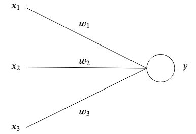
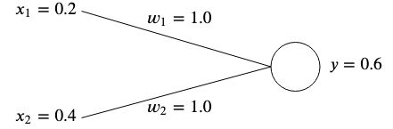

# ai-linear-associative-network

This is the simplest neural network possible. 

## Overview

### What is a perceptron?

It's the simplest conceptual representation of a neuron. 
In essence, a perceptron has one or multiple inputs $x_i$ each having a specific weight $w_i$ and one output $y$. 

At the simplest level, the perceptron's output is the sum of it's inputs times its weights. 
$$ y = \sum_{i=1}^n w_i x_i $$

### A simple example

Say we have a perceptron with two inputs $x_1 = 0.2$ and $x_2 = 0.4$, with weights $w_1 = 1.0$ and $w_2 = 1.0$.  

Then the output $y$ will be
$$ y = x_1 w_1 + x_2 w_2 = 0.2 * 1.0 + 0.4 * 1.0 = 0.6$$

### The error

If the output $y$ doesn't match the expected result, then we have an error.  
For example, if we wanted to get an expected output of $y\prime = 0.5$ then we would have a delta of 

$$ \delta = y - y\prime = 0.6 - 0.5 = 0.1$$

and we would need to adjust the weights in order to rectify that error. In our example, lowering $w_2$ from $1.0$ to $0.5$ would do the trick, since 
$$ y = y\prime = 0.2 * 0.5 + 0.4 * 1.0 = 0.5 $$

However, in order to adjust the weights of our neural networks for many different inputs and expected outputs, we need a *learning algorithm*. 

## Activation function

Normally a perceptron processes its inputs through an activation function in order to normalise it's output. 

Examples of activation functions are:
- ReLU or rectified linear unit

$$ f(x) = max(0, x) $$

- Sigmoid

$$ f(x) = \frac{1}{1 + e^{-x}} $$

- tanh

$$ f(x) = tanh(x) $$

## Learning